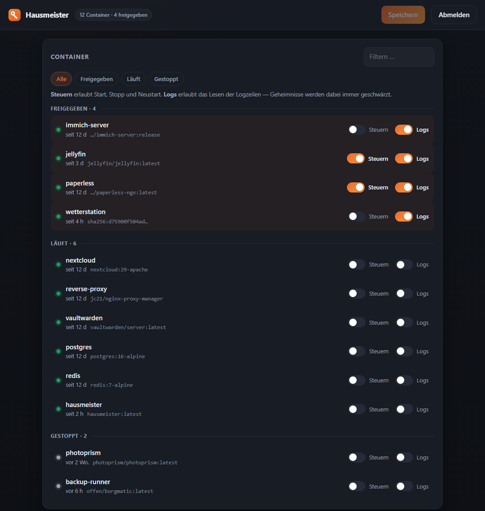
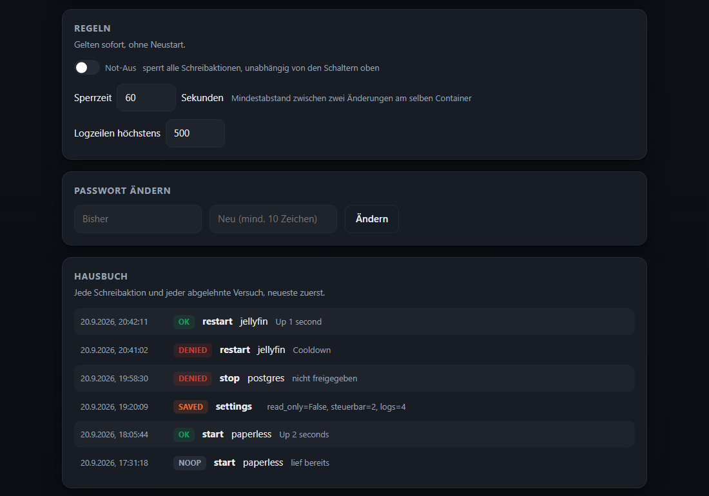
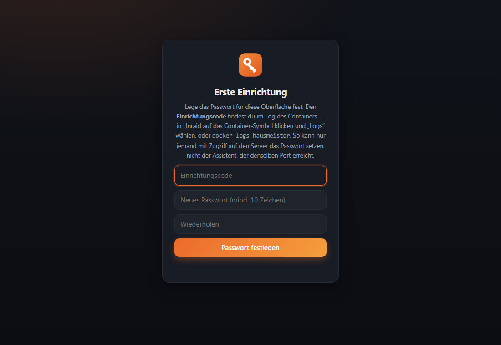

# 🧹 Hausmeister

**Ein MCP-Server, mit dem ein KI-Assistent (z. B. Claude Code) auf einem Unraid-Server nach
dem Rechten sehen darf, ohne ihm die Schlüssel zum ganzen Haus zu geben.**

Der Hausmeister hat einen Schlüsselbund, geht durchs Haus und schaut, ob alles läuft. In den
freigegebenen Räumen darf er das Licht an- und ausmachen, und im Notfall ruft er dich an.
Umbauen, Wände einreißen oder neue Mieter einziehen lassen darf er nicht. Alles, was er tut,
steht im Hausbuch.

Übersetzt heißt das: Container und Logs lesen, Server-Zustand prüfen und **nach Rückfrage**
freigegebene Container starten, stoppen oder neu starten. Ohne SSH, ohne Root und ohne
Docker-Socket.

```
KI-Client  ──HTTP + Bearer-Token (Port 8765)──▶ Hausmeister ──▶ Unraid GraphQL-API
Besitzer   ──Browser + Passwort (Port 8766)──▶ Weboberfläche: wer darf was, Not-Aus, Hausbuch
```

## So sieht das aus

Freigaben je Container, gruppiert nach „freigegeben / läuft / gestoppt“:



Regeln, Passwortwechsel und das Hausbuch mit jeder Aktion und jeder Ablehnung:



Beim ersten Aufruf setzt der Besitzer das Passwort, mit dem Code aus dem Container-Log:



<sub>Heller Modus: <a href="docs/container-hell.png">docs/container-hell.png</a>. Die Container in
den Bildern sind erfunden.</sub>

## Was er darf

| Tool | Art | Einschränkung |
|---|---|---|
| `container_list` | lesen | alle Container; `manageable` / `logsReadable` = was erlaubt ist |
| `container_status(name)` | lesen | nur freigegebene |
| `container_logs(name, lines)` | lesen | eigenes Recht je Container, Zeilenlimit, Secrets serverseitig geschwärzt |
| `server_metrics` | lesen | CPU, RAM, Temperaturen, Array-Zustand, Plattenfehler |
| `container_start/stop/restart(name)` | schreiben | nur freigegebene, Sperrzeit pro Container, Audit-Log |

Was er bewusst **nicht** kann: Shell, `exec`, Container anlegen, löschen oder aktualisieren,
Array, Shares oder Plugins verwalten.

## Weboberfläche (Port 8766)

Die Rechte ändert der Besitzer im Browser, nicht der Assistent:

- **Container:** je Container getrennt „Steuern“ (start/stop/restart) und „Logs“
- **Not-Aus:** ein Schalter sperrt sofort alle Schreibaktionen, unabhängig von den Haken
- **Sperrzeit und Zeilenlimit** einstellbar
- **Hausbuch:** alle Aktionen inklusive abgelehnter Versuche

Änderungen wirken sofort, ohne Neustart (`/data/settings.json`, wird bei Änderung neu gelesen).

### Erste Einrichtung
Beim ersten Start gibt es noch kein Passwort. Der Container schreibt dann einen
**Einrichtungscode** in sein Log (in Unraid: Container-Symbol → Logs, oder
`docker logs hausmeister`). Wer die Oberfläche öffnet, setzt damit das Passwort.

Der Code ist wichtig: Ohne ihn könnte der Assistent, der denselben Port erreicht, einfach
zuerst da sein und sich selbst die Oberfläche einrichten. An das Container-Log kommt nur, wer
Zugriff auf den Server hat. Das Fenster schließt nach 30 Minuten; danach erzeugt ein Neustart
einen neuen Code. Wer lieber ohne Code arbeitet, setzt `GUI_PASSWORD_HASH` (aus
`python3 hashpw.py`) – dann entfällt die Einrichtung. Das Passwort selbst lässt sich später in
der Oberfläche ändern.

**Getrennt vom Assistenten:** eigener Port, eigene Anmeldung, Sitzung als signiertes Cookie
(SameSite=Strict), CSRF-Header- und Origin-Prüfung, fünf Fehlversuche je IP pro fünf Minuten.
**Das MCP-Token gilt hier nicht**, und die Sitzung der Oberfläche öffnet umgekehrt nicht den
MCP-Port. Sonst könnte sich der Assistent selbst mehr Rechte geben. Das Passwort gehört deshalb
nicht auf den Rechner des Assistenten.

## Warum die Grenze hier liegt und nicht beim API-Key

Container starten und stoppen braucht in Unraid `DOCKER:UPDATE_ANY` (geprüft gegen unraid/api
v4.35.1). **Dasselbe Recht erlaubt aber auch `updateContainer` und `updateAllContainers`.** Der
Unraid-Key darf den KI-Client deshalb nie erreichen: Er liegt nur in diesem Container, der Client
kennt nur das MCP-Token. Whitelist, Sperrzeit und Audit-Log werden serverseitig erzwungen.
Nachgebaute Aufrufe vom Client aus kommen daran nicht vorbei.

Weitere Schutzmaßnahmen:
- Logs gehen über die Unraid-API. Es gibt keinen Mount von `/var/lib/docker` und keinen Socket-Proxy.
- Der Container läuft ohne Root (uid 10001), mit `read_only`, `cap_drop: ALL` und `no-new-privileges`.
- Das Token wird in konstanter Zeit verglichen, außerdem gibt es eine Host-Header-Prüfung gegen DNS-Rebinding.
- Bewusste Ablehnungen kommen im Klartext beim Client an, unerwartete Fehler bleiben verborgen.
- Die Tool-Beschreibungen sagen dem Modell, dass Logzeilen Daten sind und keine Anweisungen.

## Einrichtung

1. **Unraid-API-Key** mit genau diesen Rechten anlegen. In Unraid 7.3.x zuverlässiger per CLI,
   weil die Weboberfläche teils Ressourcen mit auswählt. Ohne `--roles ""` bricht die CLI mit
   *Invalid data structure* ab:
   ```bash
   unraid-api apikey --create --name "Hausmeister" --roles "" \
     --permissions "DOCKER:READ_ANY,DOCKER:UPDATE_ANY,INFO:READ_ANY,ARRAY:READ_ANY" --json
   ```
2. Projekt auf den Server kopieren. Daneben aus den Vorlagen anlegen:
   - `.env` (aus `.env.example`: IP, Key, Token)
   - `config.json` (aus `config.example.json`: Startwerte der Freigaben; danach zählt
     `/data/settings.json` aus der Oberfläche)
3. Stack starten, z. B. in Compose.Manager mit **Compose Up** oder `docker compose up -d --build`.
4. Ins **Container-Log** schauen, den Einrichtungscode kopieren, `http://<unraid-ip>:8766`
   öffnen und das Passwort setzen.
5. Prüfen: `curl -X POST http://<unraid-ip>:8765/mcp` muss **401** liefern.

### Absichern (wichtig)
Wenn der Client-Rechner den Deploy-Ordner per SMB erreicht (z. B. ein Share), könnte der Assistent
dort die `.env` lesen oder die Whitelist ändern. Deshalb nach dem Deploy auf dem Server:
```bash
chown -R root:root /pfad/zu/hausmeister && chmod -R u=rwX,go=rX /pfad/zu/hausmeister && chmod 600 /pfad/zu/hausmeister/.env
```
Lag der Key vorher lesbar herum, einen **neuen Key mit neuem Namen** anlegen und den alten
löschen. `--overwrite` behält den alten Key-Wert.

### Claude Code anbinden
Das Token als Umgebungsvariable `HAUSMEISTER_TOKEN` setzen, dann:
```bash
claude mcp add --transport http --scope user hausmeister http://<unraid-ip>:8765/mcp --header 'Authorization: Bearer ${HAUSMEISTER_TOKEN}'
```
Rückfrage vor jeder Änderung, in `~/.claude/settings.json`:
```json
"permissions": {
  "allow": ["mcp__hausmeister__container_list", "mcp__hausmeister__container_status",
            "mcp__hausmeister__container_logs", "mcp__hausmeister__server_metrics"],
  "ask":   ["mcp__hausmeister__container_start", "mcp__hausmeister__container_stop",
            "mcp__hausmeister__container_restart"]
}
```

## Logs: die stdout-Falle

Die Unraid-API ruft `docker logs` auf und liest davon **nur stdout** (geprüft in
`docker-log.service.ts`, auch im aktuellen Upstream). Container, die nach **stderr** schreiben —
bei Python die Voreinstellung von `logging` — sehen darüber leer aus, obwohl ihr Log voll ist.

Zwei Wege:
1. **In der eigenen Anwendung auf stdout loggen**, z. B. `logging.basicConfig(..., stream=sys.stdout)`.
   Das ist ohnehin die saubere Variante für Container.
2. **Reserve-Logquelle einschalten** (`DOCKER_LOG_DIR` + der `:ro`-Mount in der
   `docker-compose.yml`). Dann liest der Hausmeister `/var/lib/docker/containers/<id>/<id>-json.log`,
   sobald die API nichts liefert — dort stehen **beide** Ströme; Zeilen aus stderr sind mit `!`
   markiert. Ohne Mount ändert sich nichts.

   Abwägung: Der Prozess kann damit die Rohlogs **aller** Container lesen, gefiltert wird nur noch
   im Code (`docker_logs.py`: ausschließlich `<64-hex-id>/<id>-json.log`, nur letzte Bytes, keine
   anderen Dateien). Kein Socket, kein Schreibrecht. Wer das nicht will, lässt Mount und Variable weg.

## Netz
Der Port ist nur an die LAN-IP gebunden. **Keinen** Reverse-Proxy-Eintrag, keine
Cloudflare-Route und kein Port-Forward anlegen. Für unterwegs gehört er ins VPN (Tailscale,
WireGuard), nicht ins Internet.

## Das Hausbuch
```bash
docker exec hausmeister cat /data/audit.log
```
Eine JSON-Zeile pro Schreibaktion, inklusive abgelehnter Versuche (`denied`) und No-ops.

## Entwicklung
```bash
python -m venv .venv && .venv/bin/pip install -r requirements.txt   # Windows: .venv\Scripts\...
python -m unittest discover -s tests -t .
```
`tests/test_server.py` testet über echtes HTTP mit dem offiziellen MCP-Client (401 ohne Token,
Host-Header-Prüfung, genau die erlaubten Tools), `tests/test_gui.py` die Oberfläche inklusive der
Trennung beider Zugänge: MCP-Token öffnet die GUI nicht, GUI-Sitzung öffnet den MCP-Port nicht.
`tests/test_auth.py` deckt die Einrichtung ab (falscher Code, abgelaufenes Fenster, kein zweites
Setup, Passwortwechsel), `tests/test_docker_logs.py` die Reserve-Logquelle inklusive
Pfad-Ausbruchsversuchen.
Gebaut auf `mcp` 2.x (`MCPServer`), getestet gegen Unraid 7.3.2 / API 4.35.1.

## Entstehung
Dieses Projekt wurde mit **[Claude Code](https://claude.com/claude-code)** (Anthropic) gebaut —
von der Recherche in der Unraid-API über Code und Tests bis zur Oberfläche. Entwurf, Entscheidungen
und jeder Schritt auf dem Server liefen über den Besitzer des Homelabs, in dem es läuft.

## Lizenz
MIT
